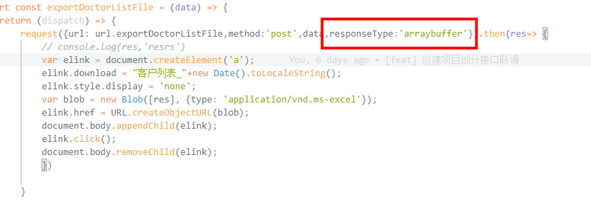

### axios post 请求下载文件流

---

注意： responseType 一定设置为'arraybuffer'，  responseType与url平级

```js
var elink = document.createElement('a');
elink.download = "客户列表_"+new Date().toLocaleString();
elink.style.display = 'none';
var blob = new Blob([res], {type: 'application/vnd.ms-excel'});
elink.href = URL.createObjectURL(blob);
document.body.appendChild(elink);
elink.click();
document.body.removeChild(elink);
```
