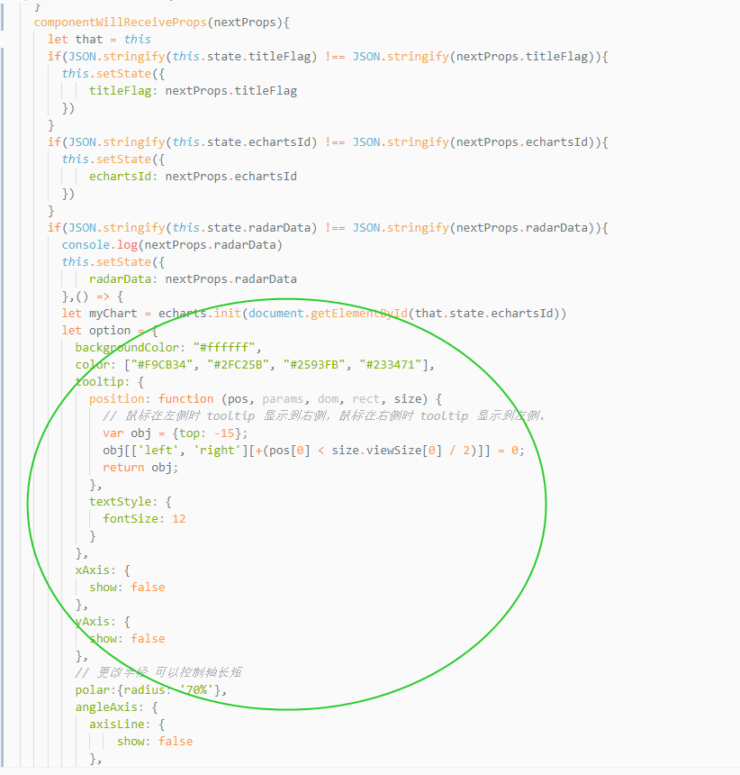

### Taro页面开发，使用echarts报错

---

Uncaught TypeError: Cannot read property 'getAttribute' of null（没找到id属性）
普通页面开发：可能是js比div标签先执行，还没有获取到id为某某的dom元素
Taro页面开发：因为本次使用的options是从父组件传递过来的， 所以这一段代码（看插图） 需要写在componentWillReceiveProps生命周期函数中

