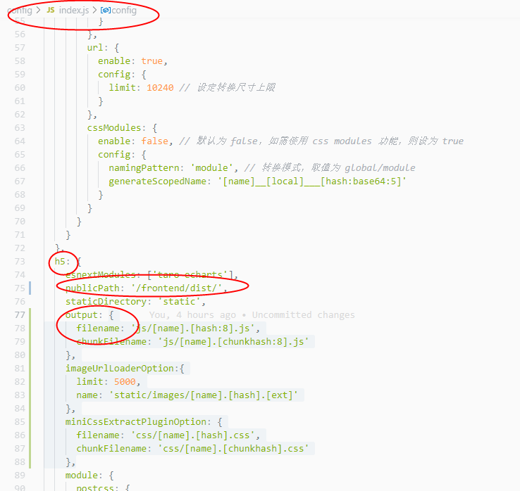

### 基于Taro框架的项目打包 需要更改打包之后的静态资源引入地址 

---

config中的index.js  h5对象中的 publicPath ，设置打包之后的引入静态资源路径

还需要清除缓存：
config中的index.js  h5对象中的 output  ，重置文件名 

```js

{
      filename: 'js/[name].[hash:8].js',
      chunkFilename: 'js/[name].[chunkhash:8].js'
    },
    imageUrlLoaderOption:{
      limit: 5000,
      name: 'static/images/[name].[hash].[ext]'
    },
    miniCssExtractPluginOption: {
      filename: 'css/[name].[hash].css',
      chunkFilename: 'css/[name].[chunkhash].css'
},

```

