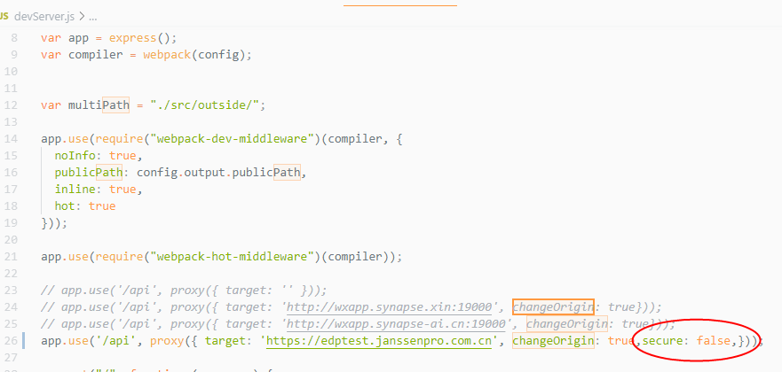

### 本地调试代理配置报错（HTTP请求）

---
Error occurred while trying to proxy request /api/auth/login from 127.0.0.1:8899 to https://edptest.janssenpro.com.cn (UNABLE_TO_VERIFY_LEAF_SIGNATURE) (https://nodejs.org/api/errors.html#errors_common_system_errors)

原因是映射的域名ssl证书有问题 

解决：设置证书免校验

