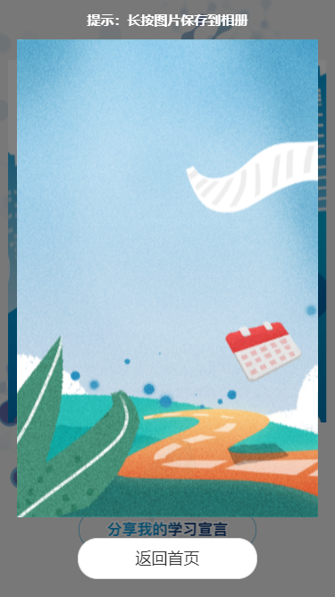

### 把页面转换成图片

---




把页面转换成图片，使用场景例如：总结页面的时候有分享到朋友圈功能，但是需要注意的是，在微信中打开的h5页面，只能先长按保存图片，然后用户自己发朋友圈。
首先把标签转换成canvas标签,下载html2canvas包，第一个参数是要转换成图片的标签，第二个参数是生成canvas标签的配置，.then中的结果是转换后的canvas标签。
然后通过canvas的toDataURL（）方法，把改标签转换成base64地址，再给image标签赋值就可以了

```js

import html2canvas from 'html2canvas';
html2canvas(document.getElementsByClassName('eighth_page_back')[0],{userCORS:true,width:window.screen.availWidth,height:window.screen.availHeight,windowWidth:document.body.scrollWidth,windowHeight:document.body.scrollHeight,x:0,y:window.pageYOffset}).then(function(canvas) {
    // console.log(canvas,'canvascanvas')
    // console.log(canvas.toDataURL("image/png"))
    that.setState({
        img: canvas.toDataURL("image/png")
    })
});

```