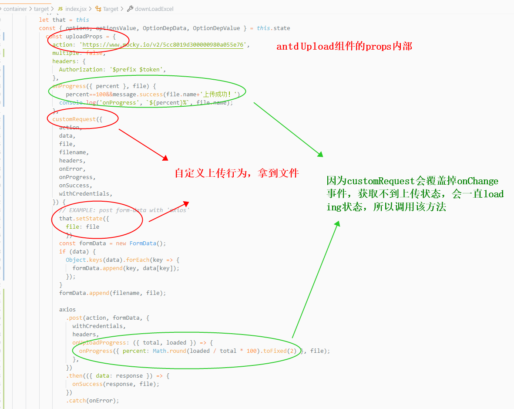
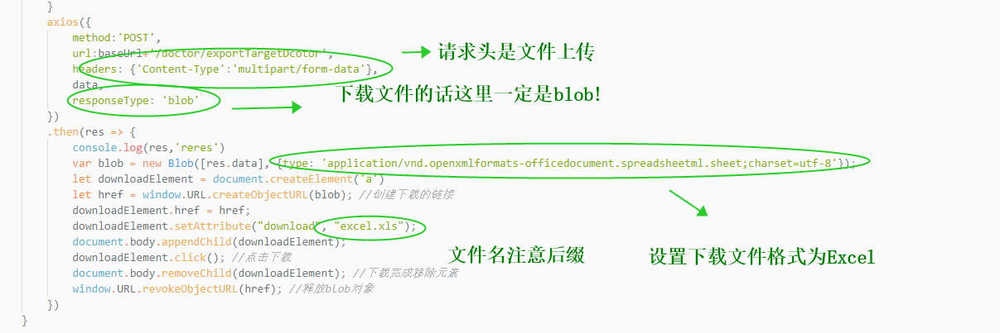

### axios上传文件和下载excel
---

```js

axios({
            method:'POST',
            url:baseUrl+'/doctor/exportTargetDcotor',
            headers: {'Content-Type':'multipart/form-data'},
            data,
            responseType: 'blob'
        })
        .then(res => {
            console.log(res,'reres')
            var blob = new Blob([res.data], {type: 'application/vnd.openxmlformats-officedocument.spreadsheetml.sheet;charset=utf-8'});
            let downloadElement = document.createElement('a')
            let href = window.URL.createObjectURL(blob); //创建下载的链接
            downloadElement.href = href;
            downloadElement.setAttribute("download", "excel.xls");
            document.body.appendChild(downloadElement);
            downloadElement.click(); //点击下载
            document.body.removeChild(downloadElement); //下载完成移除元素
            window.URL.revokeObjectURL(href); //释放blob对象
        })

```


